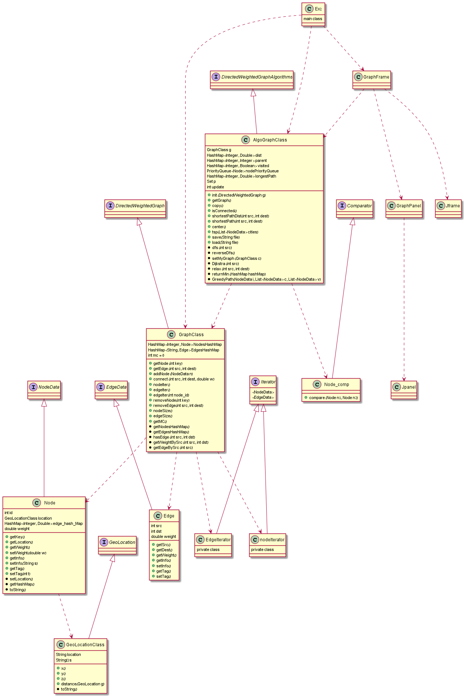

#Ex2 
@auther Ofir Regev

*introduction*

This project is about directed weighted graphs.
Weighted directed graphs are (simple) directed graphs with weights assigned to their arrows.
We asked to implement interfaces of directed weighted graphs and of directed weighted graphs algorithms, and to represent the graphs by GUI presentation.

*Project Material*

For understanding all the problem space i assisted the videos of William Fiset and wikipedia:

https://www.youtube.com/channel/UCD8yeTczadqdARzQUp29PJw
https://en.wikipedia.org/wiki/Directed_graph
https://en.wikipedia.org/wiki/Graph_center
https://en.wikipedia.org/wiki/Dijkstra%27s_algorithm

Also, for few of the algorithms implementations i assisted GeeksForGeeks and StackOverFlow forums.
https://www.geeksforgeeks.org/
https://stackoverflow.com/

*UML of the classes in the project*

This uml represent the interfaces and the class of the project.
The regular arrow means that this class implement the interface below.
The green points means function from the interface, and the black points means that this is a function that added by me for the project (Explanations about those function will come next).
The dashed line means that this class depends on the other class.

*Explenation on the classes and the interfaces

